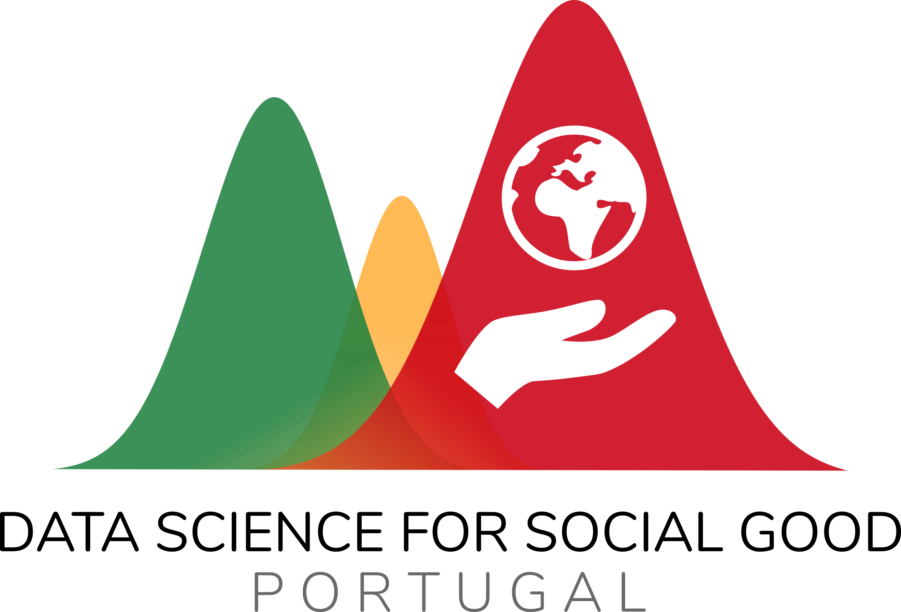

# Projecto 🚀

_**TODO**: Here goes the project name. Choose an emoji/emoji combination for it, it's fun!_

## Beneficiário

_**TODO**: Here goes the description of our certainly wonderful Beneficiary._

_**TODO**: In the folder `assets`, replace `beneficiary_logo.png` with the actual logo of the Beneficiary (keeping the same filename)._

## Descrição

_**TODO**: In here goes the project's context and description, as found in the scoping document._

## Objectivos

_**TODO**: In here the main goals of the project._

## Produtos finais

_**TODO**: As goals must always be translated into concrete deliverables, in where we include those deliverables._

## Equipa

_**TODO**: In here list the team (optionally with links to their LinkedIn profiles/websites)._

## Duração

_**TODO**: Estimated project starts and end dates._

# Repositório

## Estrutura

O repositório está organizado da seguinte forma: 

+ `assets/`: **TODO**
+ `data/`: **TODO**
+ `deliverables/`: **TODO**
+ `notebooks/`: **TODO**
+ `src/`: **TODO**
+ `requirements.txt`: **TODO**

## Reprodutibilidade

Ambientes virtuais, dependências, etc. **TODO**

# Contactos

+ Pontos de contacto DSSG PT: **TODO** (name, e-mail)

+ Ponto de contacto Beneficiário: **TODO** (name, e-mail)
